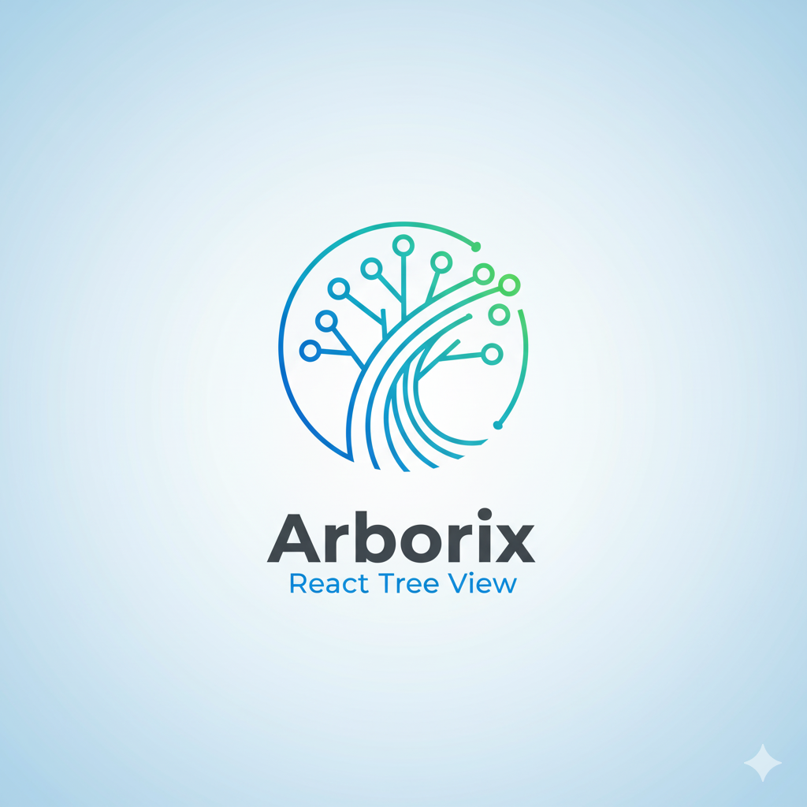

<div align="center">
  
  <h1 align="center">Arborix</h1>
  <p align="center">
    A High-Performance React Tree View Component with Virtualization, Drag & Drop, and Advanced Features
    <br />
    <a href="https://github.com/wesleyxmns/arborix/issues">Report Bug</a>
    ·
    <a href="https://github.com/wesleyxmns/arborix/issues">Request Feature</a>
  </p>
</div>

## 📖 About

**Arborix** is a feature-rich, high-performance tree view component built with React and TypeScript. Designed for handling large datasets with millions of nodes, it uses **virtualization** to render only visible items, ensuring smooth performance. With built-in support for drag & drop, multi-selection, clipboard operations, search, keyboard navigation, and persistent state, Arborix is production-ready out of the box.

## ✨ Features

### Core Functionality
- **🚀 High Performance with Virtualization** - Powered by `@tanstack/react-virtual`, renders only visible nodes for optimal performance with large datasets
- **🖱️ Advanced Drag & Drop** - Intuitive reordering with `@dnd-kit`, visual drop indicators (before/after/inside), and smart zone detection
- **🔍 Fuzzy Search** - Integrated search with result highlighting and keyboard navigation (Next/Previous)
- **✍️ Inline Editing** - Double-click or F2/Enter to rename nodes directly in the tree
- **✅ Tri-State Checkboxes** - Full support for checked/unchecked/indeterminate states with parent-child propagation
- **💾 State Persistence** - Automatically saves expanded/selected/checked states to localStorage

### Selection & Navigation
- **Multi-Selection** - Click, Ctrl+Click, Shift+Click for range selection, Ctrl+A to select all
- **Keyboard Navigation** - Full arrow key support, Home/End, Enter, Space
- **Focus Management** - Accessible focus indicators with proper ARIA attributes
- **Click Outside to Deselect** - Automatically clears selection when clicking outside the tree

### Clipboard Operations
- **Cut/Copy/Paste** - Full clipboard support with Ctrl+X, Ctrl+C, Ctrl+V
- **Multi-Item Operations** - Cut, copy, paste multiple nodes at once
- **Visual Feedback** - Cut items display with reduced opacity, clipboard status indicator in toolbar
- **Smart Paste** - Paste button automatically disabled when clipboard is empty

### Advanced Features
- **Undo/Redo** - Complete history management with Ctrl+Z and Ctrl+Shift+Z
- **Context Menu** - Right-click menu with customizable actions (rename, duplicate, cut, copy, paste, delete, add child/sibling)
- **Expand/Collapse All** - Toolbar buttons to expand or collapse all nodes at once
- **Lazy Loading** - Support for async data loading with `onLoadData` callback
- **Custom Rendering** - Fully customizable node rendering via `renderNode` prop
- **Plugin System** - Extensible architecture for adding custom functionality
- **Accessibility** - Full ARIA support with proper roles, labels, and keyboard navigation

### User Experience
- **Smooth Animations** - Powered by Framer Motion for fluid transitions
- **Visual Drop Zones** - Clear indicators showing where items will be dropped
- **Drag Toggle** - Enable/disable drag & drop on the fly with toolbar button
- **Search Highlighting** - Current search result highlighted differently from other matches
- **Loading States** - Visual loading indicators for async operations

## 📦 Installation

```bash
# With npm
npm install arborix

# With yarn
yarn add arborix

# With pnpm
pnpm add arborix
```

## 🚀 Quick Start

```tsx
import React, { useState } from 'react';
import { Arborix, TreeData } from 'arborix';

const initialData: TreeData = [
  { 
    id: "1", 
    label: 'Documents', 
    children: [
      { id: "1.1", label: 'Reports' },
      { id: "1.2", label: 'Contracts' },
    ]
  },
  { 
    id: "2", 
    label: 'Images', 
    children: [
      { id: "2.1", label: 'logo.png' },
      { id: "2.2", label: 'avatar.jpg' },
    ]
  },
];

function App() {
  const [data, setData] = useState(initialData);

  return (
    <div style={{ height: 600, width: 400 }}>
      <Arborix
        data={data}
        onDataChange={setData}
        height={600}
        rowHeight={32}
        showCheckboxes={true}
        enableDragDrop={true}
        enableSearch={true}
        enableInlineEdit={true}
        enableContextMenu={true}
        showExpandButtons={true}
        persistenceKey="my-tree"
      />
    </div>
  );
}

export default App;
```

## ⚙️ Props

| Property | Type | Default | Description |
|----------|------|---------|-------------|
| **`data`** | `TreeData` | `[]` | **Required.** Array of tree nodes in nested format |
| **`onDataChange`** | `(data: TreeData) => void` | `undefined` | **Required** for drag & drop, editing, and mutations to persist |
| `height` | `number` | `600` | Height of the tree container (required for virtualization) |
| `rowHeight` | `number` | `32` | Height of each row in pixels |
| `showCheckboxes` | `boolean` | `false` | Enable tri-state checkboxes |
| `enableDragDrop` | `boolean` | `true` | Enable drag and drop functionality |
| `enableSearch` | `boolean` | `true` | Show search bar with fuzzy search |
| `enableInlineEdit` | `boolean` | `true` | Allow renaming nodes via double-click or F2 |
| `enableContextMenu` | `boolean` | `true` | Enable right-click context menu |
| `showExpandButtons` | `boolean` | `false` | Show Expand All/Collapse All buttons in toolbar |
| `persistenceKey` | `string` | `undefined` | Key for persisting state in localStorage |
| `renderNode` | `(node: TreeNode) => ReactNode` | `undefined` | Custom node rendering function |
| `onLoadData` | `(node: TreeNode) => Promise<TreeNode[]>` | `undefined` | Async callback for lazy loading children |
| `contextMenuOptions` | `object` | `undefined` | Customize which context menu items to show |
| `customContextMenuItems` | `(node: TreeNode) => ContextMenuItem[]` | `undefined` | Add custom context menu items |
| `plugins` | `TreePlugin[]` | `[]` | Array of custom plugins |

## ⌨️ Keyboard Shortcuts

### Navigation
- **Arrow Up/Down** - Move focus between nodes
- **Arrow Right** - Expand focused node or move to first child
- **Arrow Left** - Collapse focused node or move to parent
- **Home** - Jump to first node
- **End** - Jump to last node
- **Enter** - Select focused node
- **Space** - Toggle checkbox (if enabled) or select node

### Selection
- **Ctrl/Cmd + A** - Select all nodes
- **Ctrl/Cmd + Click** - Multi-select individual nodes
- **Shift + Click** - Range selection

### Editing
- **F2** or **Enter** (on selected node) - Start inline editing
- **Escape** - Cancel editing
- **Enter** (while editing) - Save changes

### Clipboard
- **Ctrl/Cmd + X** - Cut selected nodes
- **Ctrl/Cmd + C** - Copy selected nodes
- **Ctrl/Cmd + V** - Paste clipboard contents
- **Ctrl/Cmd + D** - Duplicate selected nodes
- **Delete** - Delete selected nodes

### History
- **Ctrl/Cmd + Z** - Undo
- **Ctrl/Cmd + Shift + Z** or **Ctrl/Cmd + Y** - Redo

### Search
- **Ctrl/Cmd + F** - Focus search bar (when enabled)

## 🎨 Advanced Usage

### Custom Node Rendering

```tsx
<Arborix
  data={data}
  onDataChange={setData}
  renderNode={(node) => (
    <div className="flex items-center gap-2">
      <span className="text-blue-500">{node.icon}</span>
      <span className="font-medium">{node.label}</span>
      {node.metadata?.badge && (
        <span className="badge">{node.metadata.badge}</span>
      )}
    </div>
  )}
/>
```

### Lazy Loading

```tsx
<Arborix
  data={data}
  onDataChange={setData}
  onLoadData={async (node) => {
    const response = await fetch(`/api/nodes/${node.id}/children`);
    const children = await response.json();
    return children;
  }}
/>
```

### Custom Context Menu

```tsx
<Arborix
  data={data}
  onDataChange={setData}
  contextMenuOptions={{
    rename: true,
    duplicate: true,
    cut: true,
    copy: true,
    paste: true,
    delete: true,
    addChild: true,
    addSibling: false, // Hide "Add Sibling"
  }}
  customContextMenuItems={(node) => [
    {
      label: 'Export',
      onClick: () => exportNode(node),
    },
    {
      label: 'Share',
      onClick: () => shareNode(node),
    },
  ]}
/>
```

### State Persistence

```tsx
// State is automatically saved to localStorage when persistenceKey is provided
<Arborix
  data={data}
  onDataChange={setData}
  persistenceKey="my-app-tree"
  // Expanded nodes, selected nodes, and checked nodes are persisted
/>
```

## 🏗️ Data Utilities

### Converting Flat Data to Tree

If your data is in flat format, use the `TreeDataBuilder`:

```typescript
import { TreeDataBuilder } from 'arborix';

const flatData = [
  { id: '1', name: 'Root 1', parentId: null },
  { id: '2', name: 'Child of 1', parentId: '1' },
  { id: '3', name: 'Child of 2', parentId: '2' },
];

const treeData = TreeDataBuilder.fromFlat(flatData, {
  label: 'name',        // Map 'name' field to 'label'
  parentIdKey: 'parentId' // Specify parent reference field
});
```

## 🔌 Plugin System

Extend Arborix with custom plugins:

```typescript
import { TreePlugin } from 'arborix';

const myPlugin: TreePlugin = {
  name: 'my-custom-plugin',
  setup: (tree) => {
    // Access tree instance
    const state = tree.getState();
    
    // Listen to events
    tree.emitter.on('node:select', (nodeId) => {
      console.log('Node selected:', nodeId);
    });
    
    // Cleanup function (optional)
    return () => {
      tree.emitter.off('node:select');
    };
  },
};

<Arborix
  data={data}
  onDataChange={setData}
  plugins={[myPlugin]}
/>
```

## 🎯 TypeScript Support

Arborix is written in TypeScript and provides full type definitions:

```typescript
import { TreeNode, TreeData, ArborixProps, TreeNodeId } from 'arborix';

interface CustomNode extends TreeNode {
  metadata: {
    icon: string;
    color: string;
    badge?: string;
  };
}

const data: CustomNode[] = [
  {
    id: '1',
    label: 'Custom Node',
    metadata: {
      icon: '📁',
      color: 'blue',
      badge: 'New',
    },
  },
];
```


## 🤝 Contributing

Contributions are welcome! Please feel free to submit a Pull Request.

## 📜 License

Distributed under the MIT License. See `LICENSE` for more information.

## 🙏 Acknowledgments

Built with:
- [React](https://react.dev/)
- [@tanstack/react-virtual](https://tanstack.com/virtual) - Virtualization
- [@dnd-kit](https://dndkit.com/) - Drag and Drop
- [Framer Motion](https://www.framer.com/motion/) - Animations
- [Immer](https://immerjs.github.io/immer/) - Immutable State
- [Lucide React](https://lucide.dev/) - Icons
